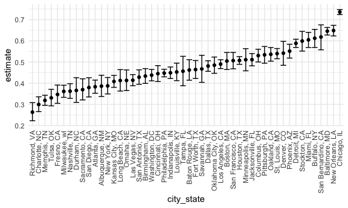
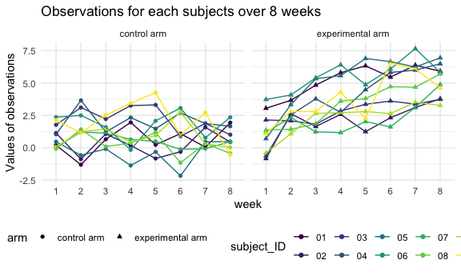

HW5
================
Chen Mo
11/16/2020

# Problem 1

First, load the data.

``` r
homicide_data = 
        read_csv("./data/homicide-data.csv")
```

    ## Parsed with column specification:
    ## cols(
    ##   uid = col_character(),
    ##   reported_date = col_double(),
    ##   victim_last = col_character(),
    ##   victim_first = col_character(),
    ##   victim_race = col_character(),
    ##   victim_age = col_character(),
    ##   victim_sex = col_character(),
    ##   city = col_character(),
    ##   state = col_character(),
    ##   lat = col_double(),
    ##   lon = col_double(),
    ##   disposition = col_character()
    ## )

The raw data contains 12 columns and 52179 rows in total. The data
provides information of more than 52,000 criminal homicides over past
decades in 50 of the largest American cities. The data includes the
location of the killing, whether an arrest was made and, in most cases,
basic demographic information about each victim.

Then, clean the data.

``` r
homicide_df = 
        homicide_data %>%
        janitor::clean_names() %>% 
        mutate(
                city_state = str_c(city, state, sep = ", "),
                disposition = recode(disposition, "Closed without arrest" = "Unsolved"),
                disposition = recode(disposition, "Open/No arrest" = "Unsolved"),
                disposition = recode(disposition, "Closed by arrest" = "Solved")
        ) %>%
        select(city_state, disposition) %>% 
        filter(city_state != "Tulsa, AL")
```

Obtain the total number of homicides and the number of unsolved
homicides.

``` r
homicide_total = 
        homicide_df %>% 
        group_by(city_state) %>% 
        summarise(
                hom_total = n(),
                hom_unsolved = sum(disposition == "Unsolved")
        )
```

    ## `summarise()` ungrouping output (override with `.groups` argument)

Estimate the proportion of homicides that are unsolved in the city of
Baltimore, MD.

``` r
prop.test(
        homicide_total %>% filter(city_state == "Baltimore, MD") %>% pull(hom_unsolved),
        homicide_total %>% filter(city_state == "Baltimore, MD") %>% pull(hom_total)
) %>%
        broom::tidy() %>% 
        select(estimate, conf.low, conf.high)
```

    ## # A tibble: 1 x 3
    ##   estimate conf.low conf.high
    ##      <dbl>    <dbl>     <dbl>
    ## 1    0.646    0.628     0.663

Estimate the proportion of homicides that are unsolved in all cities.

``` r
results_df = 
        homicide_total %>% 
        mutate(
                prop_tests = map2(.x = hom_unsolved, .y = hom_total, ~prop.test(x = .x, n = .y)),
                tidy_tests = map(.x = prop_tests, ~broom::tidy(.x))
        ) %>% 
        select(-prop_tests) %>% 
        unnest(tidy_tests) %>% 
        select(city_state, estimate, conf.low, conf.high)
```

Creat a plot.

``` r
results_df %>% 
        mutate(
                city_state = fct_reorder(city_state, estimate)
        ) %>% 
        ggplot(aes(x = city_state, y = estimate)) +
        geom_point() +
        geom_errorbar(aes(ymin = conf.low, ymax = conf.high)) +
        theme(axis.text.x = element_text(angle = 90, vjust = 0.5, hjust = 1))
```



# Problem 2

Load the data and clean it.

``` r
path_df = 
        tibble(
                path = list.files("data/control and experimental")
        ) %>%
        separate(path, into = c("arm", "subject_ID", sep = 4)) %>% 
        mutate(
                arm = recode(arm, "con" = "control arm", "exp" = "experimental arm"),
                path = list.files("data/control and experimental"),
                path = str_c("./data/control and experimental/", path),
                data = map(.x = path, ~read_csv(.x))
        ) %>%
        select(arm, subject_ID, data) %>% 
        unnest(data) %>%
        pivot_longer(
                week_1:week_8,
                names_to = "week",
                values_to = "observations",
                names_prefix = "week_")
```

    ## Parsed with column specification:
    ## cols(
    ##   week_1 = col_double(),
    ##   week_2 = col_double(),
    ##   week_3 = col_double(),
    ##   week_4 = col_double(),
    ##   week_5 = col_double(),
    ##   week_6 = col_double(),
    ##   week_7 = col_double(),
    ##   week_8 = col_double()
    ## )
    ## Parsed with column specification:
    ## cols(
    ##   week_1 = col_double(),
    ##   week_2 = col_double(),
    ##   week_3 = col_double(),
    ##   week_4 = col_double(),
    ##   week_5 = col_double(),
    ##   week_6 = col_double(),
    ##   week_7 = col_double(),
    ##   week_8 = col_double()
    ## )
    ## Parsed with column specification:
    ## cols(
    ##   week_1 = col_double(),
    ##   week_2 = col_double(),
    ##   week_3 = col_double(),
    ##   week_4 = col_double(),
    ##   week_5 = col_double(),
    ##   week_6 = col_double(),
    ##   week_7 = col_double(),
    ##   week_8 = col_double()
    ## )
    ## Parsed with column specification:
    ## cols(
    ##   week_1 = col_double(),
    ##   week_2 = col_double(),
    ##   week_3 = col_double(),
    ##   week_4 = col_double(),
    ##   week_5 = col_double(),
    ##   week_6 = col_double(),
    ##   week_7 = col_double(),
    ##   week_8 = col_double()
    ## )
    ## Parsed with column specification:
    ## cols(
    ##   week_1 = col_double(),
    ##   week_2 = col_double(),
    ##   week_3 = col_double(),
    ##   week_4 = col_double(),
    ##   week_5 = col_double(),
    ##   week_6 = col_double(),
    ##   week_7 = col_double(),
    ##   week_8 = col_double()
    ## )
    ## Parsed with column specification:
    ## cols(
    ##   week_1 = col_double(),
    ##   week_2 = col_double(),
    ##   week_3 = col_double(),
    ##   week_4 = col_double(),
    ##   week_5 = col_double(),
    ##   week_6 = col_double(),
    ##   week_7 = col_double(),
    ##   week_8 = col_double()
    ## )
    ## Parsed with column specification:
    ## cols(
    ##   week_1 = col_double(),
    ##   week_2 = col_double(),
    ##   week_3 = col_double(),
    ##   week_4 = col_double(),
    ##   week_5 = col_double(),
    ##   week_6 = col_double(),
    ##   week_7 = col_double(),
    ##   week_8 = col_double()
    ## )
    ## Parsed with column specification:
    ## cols(
    ##   week_1 = col_double(),
    ##   week_2 = col_double(),
    ##   week_3 = col_double(),
    ##   week_4 = col_double(),
    ##   week_5 = col_double(),
    ##   week_6 = col_double(),
    ##   week_7 = col_double(),
    ##   week_8 = col_double()
    ## )
    ## Parsed with column specification:
    ## cols(
    ##   week_1 = col_double(),
    ##   week_2 = col_double(),
    ##   week_3 = col_double(),
    ##   week_4 = col_double(),
    ##   week_5 = col_double(),
    ##   week_6 = col_double(),
    ##   week_7 = col_double(),
    ##   week_8 = col_double()
    ## )
    ## Parsed with column specification:
    ## cols(
    ##   week_1 = col_double(),
    ##   week_2 = col_double(),
    ##   week_3 = col_double(),
    ##   week_4 = col_double(),
    ##   week_5 = col_double(),
    ##   week_6 = col_double(),
    ##   week_7 = col_double(),
    ##   week_8 = col_double()
    ## )
    ## Parsed with column specification:
    ## cols(
    ##   week_1 = col_double(),
    ##   week_2 = col_double(),
    ##   week_3 = col_double(),
    ##   week_4 = col_double(),
    ##   week_5 = col_double(),
    ##   week_6 = col_double(),
    ##   week_7 = col_double(),
    ##   week_8 = col_double()
    ## )
    ## Parsed with column specification:
    ## cols(
    ##   week_1 = col_double(),
    ##   week_2 = col_double(),
    ##   week_3 = col_double(),
    ##   week_4 = col_double(),
    ##   week_5 = col_double(),
    ##   week_6 = col_double(),
    ##   week_7 = col_double(),
    ##   week_8 = col_double()
    ## )
    ## Parsed with column specification:
    ## cols(
    ##   week_1 = col_double(),
    ##   week_2 = col_double(),
    ##   week_3 = col_double(),
    ##   week_4 = col_double(),
    ##   week_5 = col_double(),
    ##   week_6 = col_double(),
    ##   week_7 = col_double(),
    ##   week_8 = col_double()
    ## )
    ## Parsed with column specification:
    ## cols(
    ##   week_1 = col_double(),
    ##   week_2 = col_double(),
    ##   week_3 = col_double(),
    ##   week_4 = col_double(),
    ##   week_5 = col_double(),
    ##   week_6 = col_double(),
    ##   week_7 = col_double(),
    ##   week_8 = col_double()
    ## )
    ## Parsed with column specification:
    ## cols(
    ##   week_1 = col_double(),
    ##   week_2 = col_double(),
    ##   week_3 = col_double(),
    ##   week_4 = col_double(),
    ##   week_5 = col_double(),
    ##   week_6 = col_double(),
    ##   week_7 = col_double(),
    ##   week_8 = col_double()
    ## )
    ## Parsed with column specification:
    ## cols(
    ##   week_1 = col_double(),
    ##   week_2 = col_double(),
    ##   week_3 = col_double(),
    ##   week_4 = col_double(),
    ##   week_5 = col_double(),
    ##   week_6 = col_double(),
    ##   week_7 = col_double(),
    ##   week_8 = col_double()
    ## )
    ## Parsed with column specification:
    ## cols(
    ##   week_1 = col_double(),
    ##   week_2 = col_double(),
    ##   week_3 = col_double(),
    ##   week_4 = col_double(),
    ##   week_5 = col_double(),
    ##   week_6 = col_double(),
    ##   week_7 = col_double(),
    ##   week_8 = col_double()
    ## )
    ## Parsed with column specification:
    ## cols(
    ##   week_1 = col_double(),
    ##   week_2 = col_double(),
    ##   week_3 = col_double(),
    ##   week_4 = col_double(),
    ##   week_5 = col_double(),
    ##   week_6 = col_double(),
    ##   week_7 = col_double(),
    ##   week_8 = col_double()
    ## )
    ## Parsed with column specification:
    ## cols(
    ##   week_1 = col_double(),
    ##   week_2 = col_double(),
    ##   week_3 = col_double(),
    ##   week_4 = col_double(),
    ##   week_5 = col_double(),
    ##   week_6 = col_double(),
    ##   week_7 = col_double(),
    ##   week_8 = col_double()
    ## )
    ## Parsed with column specification:
    ## cols(
    ##   week_1 = col_double(),
    ##   week_2 = col_double(),
    ##   week_3 = col_double(),
    ##   week_4 = col_double(),
    ##   week_5 = col_double(),
    ##   week_6 = col_double(),
    ##   week_7 = col_double(),
    ##   week_8 = col_double()
    ## )

Make a spaghetti plot showing observations on each subject over time.

``` r
path_df %>% 
        mutate(subject_ID = str_c(arm, subject_ID)) %>% 
        ggplot(aes(x = week, y = observations, color = arm, group = subject_ID)) +
        geom_point() +
        geom_line() + 
        labs(title = "Observations for each subjects over 8 weeks",
             subtitle = "Control arm VS Experimental arm",
             y = "Values of observations")
```


I also create a plot which shows values of observations by different arm
on each subject over time.

``` r
path_df %>% 
        ggplot(aes(x = week, y = observations, color = subject_ID, group = subject_ID)) +
        geom_point(aes(shape = arm)) +
        geom_line() + 
        facet_grid(.~arm) +
        labs(title = "Observations for each subjects over 8 weeks",
             y = "Values of observations")
```


From the plots above, we can see that the values of observations of the
experimental group have an increasing trend while the values of
observations of the control group fluctuated a lot. The average value of
observations of the experimental group is larger than that of
observations of the control group. \# Problem 3
